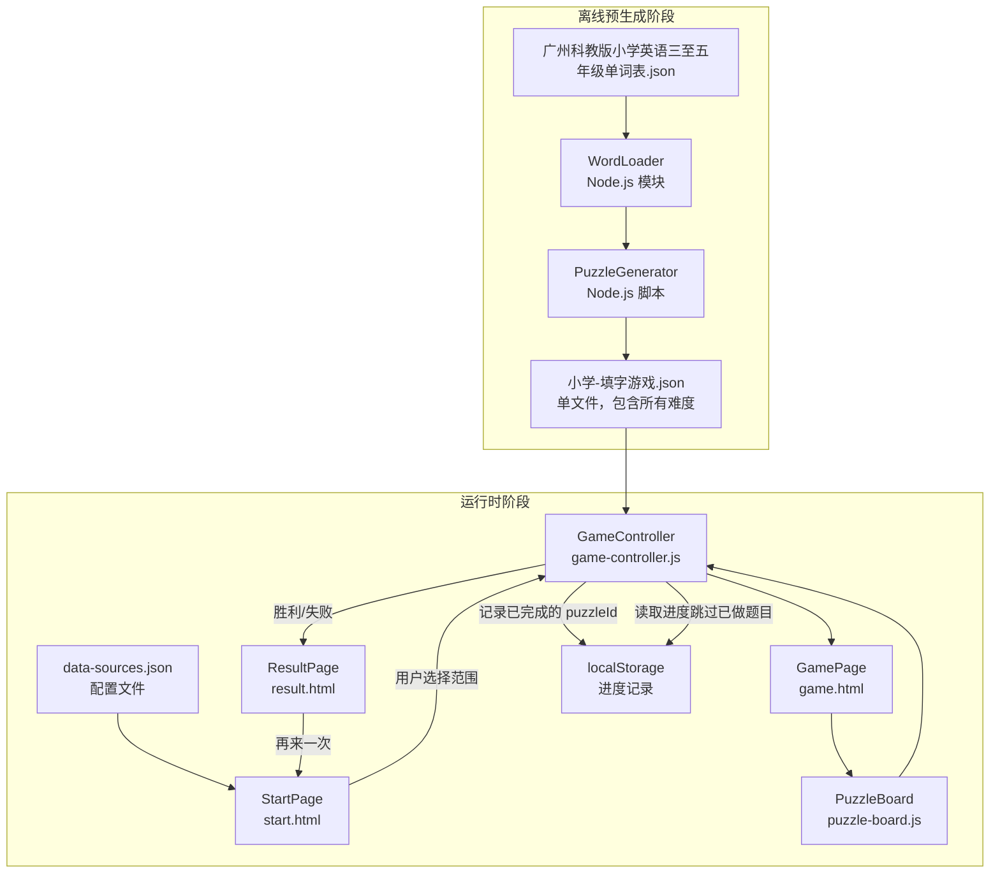
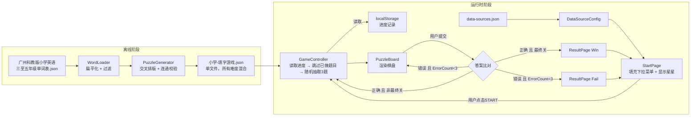
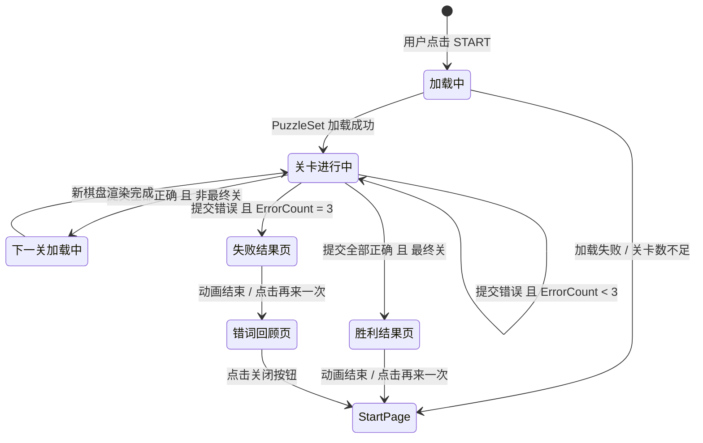

# 技术设计文档：英语填字游戏（Crossword Game）

> 本文档依据《需求文档》（requirements.md）编写，在任何代码文件创建之前确立技术设计。

---

## 目录

1. [软件架构总览（Overview）](#overview)
2. [模块划分与职责（Architecture）](#architecture)
3. [组件接口（Components and Interfaces）](#components-and-interfaces)
4. [数据模型（Data Models）](#data-models)
5. [正确性属性（Correctness Properties）](#correctness-properties)
6. [错误处理（Error Handling）](#error-handling)
7. [测试策略（Testing Strategy）](#testing-strategy)

---

## Overview

*（软件架构总览）*

## 1. 软件架构总览

### 1.1 整体架构

本项目采用 **纯 H5 + 原生 JavaScript** 方案，无需构建工具，直接在浏览器运行，后续可迁移至微信小程序。

架构分为两个独立阶段：

| 阶段 | 说明 |
|------|------|
| **离线预生成阶段** | 在开发者机器上运行 Node.js 脚本，将原始单词 JSON 转换为可直接加载的 PuzzleSet JSON 文件（每个单词库一个文件，包含所有难度的题目） |
| **运行时阶段** | 浏览器加载静态 HTML/CSS/JS，读取预生成 JSON，从 localStorage 读取进度跳过已做过的题目，无需网络请求 |


### 1.2 整体架构图



### 1.3 页面组织方式

采用**多文件 HTML** 方式（每个页面独立 HTML 文件），页面间通过 URL 参数传递状态（如当前难度、选择的范围）。选择多文件而非单文件 SPA，是为了保持结构清晰，同时简化向微信小程序页面（page）结构迁移的工作量。


---

## Architecture

*（模块划分与职责）*

## 2. 模块划分与职责

### 2.1 WordLoader（单词加载器）

| 属性 | 说明 |
|------|------|
| **运行环境** | Node.js（离线脚本） |
| **输入** | `广州科教版小学英语三至五年级单词表.json` |
| **输出** | `Array<{word: string, meaning: string}>` 经过扁平化的单词列表 |
| **职责** | 递归遍历 JSON 层级（grade → terms → units → words），提取所有 `en`/`zh` 字段并过滤非法词条（含空格、连字符、标点，或长度 < 3 / > 20 的词） |

**过滤规则（正则表达式）：**
```js
const VALID_WORD = /^[A-Za-z]{3,20}$/;
```

### 2.2 PuzzleGenerator（填字生成器，离线脚本）

| 属性 | 说明 |
|------|------|
| **运行环境** | Node.js |
| **输入** | WordLoader 输出的合法单词列表、目标难度配置 |
| **输出** | 每难度一个 `PuzzleSet[]` JSON 文件 |
| **职责** | 按难度规则组合单词，执行交叉放置算法，校验连通性，生成棋盘坐标，保存 JSON |

每难度单词数量规则：

| 难度 | 每组单词数 | 棋盘提示 | 下方中文提示 |
|------|-----------|---------|------------|
| 初级 | 恰好 4 个 | 无 | 有编号，正常排列 |
| 中级 | 恰好 4 个 | 每词首字母预填 | 无编号，随机排列 |
| 高级 | 恰好 4 个 | 1-2个随机非首字母预填 | 无编号，随机排列 |


### 2.3 DataSourceConfig（配置读取器）

| 属性 | 说明 |
|------|------|
| **运行环境** | 浏览器 |
| **输入** | `data-sources.json` 文件（fetch） |
| **输出** | `Array<DataSourceEntry>` |
| **职责** | 加载并解析配置文件，向 StartPage 提供范围条目列表；捕获加载失败并通知 StartPage 显示错误 |

### 2.4 StartPage（启动页面）

| 属性 | 说明 |
|------|------|
| **运行环境** | 浏览器，`start.html` |
| **输入** | DataSourceConfig、用户交互事件 |
| **输出** | 导航至 `game.html?scope=&difficulty=` |
| **职责** | 渲染彩虹标题、松鼠吉祥物、字母填入动画；动态填充范围下拉菜单；管理难度选择控件状态；验证可用性后启动游戏 |

### 2.5 PuzzleBoard（棋盘组件）

| 属性 | 说明 |
|------|------|
| **运行环境** | 浏览器，`game.html` 内 |
| **输入** | 当前关卡的 `PuzzleSet` 数据 |
| **输出** | DOM 棋盘、用户输入事件 |
| **职责** | 根据 `boardRows × boardCols` 渲染网格；区分输入格与暗格；绘制单词编号上标；渲染下方提示列表；处理单字符输入与过滤；**按单词顺序导航焦点**（填完一个单词后自动跳到下一个单词的第一个空格）；**格子固定32px** |

### 2.6 GameController（游戏控制器）

| 属性 | 说明 |
|------|------|
| **运行环境** | 浏览器，`game-controller.js` |
| **输入** | 加载的 `PuzzleSet[]`、用户提交/取消事件 |
| **输出** | 关卡状态变化、触发 ResultPage 或下一关加载 |
| **职责** | 管理关卡序列（随机抽取 + 去重）；维护 ErrorCount；执行答案比对（不区分大小写）；触发胜利/失败流程；更新进度文字 |

### 2.7 ResultPage（结果页面）

| 属性 | 说明 |
|------|------|
| **运行环境** | 浏览器，`result.html` |
| **输入** | URL 参数（`result=win|fail`）或 sessionStorage 传递的结果 |
| **输出** | 动画显示、自动跳转 StartPage 或 WrongWordsPage |
| **职责** | 播放 2–5 秒胜利/失败动画；显示对应文字；胜利时自动返回 StartPage，失败时跳转到 WrongWordsPage（错词回顾页） |

### 2.8 WrongWordsPage（错词回顾页面）

| 属性 | 说明 |
|------|------|
| **运行环境** | 浏览器，`wrong-words.html` |
| **输入** | sessionStorage 传递的错词数据（`wrongWords`） |
| **输出** | 错词列表显示、关闭后返回 StartPage |
| **职责** | 从 sessionStorage 读取失败关卡中答错的单词列表；渲染英文单词 + 中文意思；点击关闭按钮后清除 sessionStorage 并返回 StartPage |


---

## Components and Interfaces

*（文件结构与接口定义）*

## 3. 文件结构说明

```
CrossGame(小程序)/
│
├── data/                                  # 预生成的游戏数据
│   ├── data-sources.json                  # 范围配置文件（displayName + dataPath）
│   └── 小学-填字游戏.json                  # 单文件，包含所有 PuzzleSet（难度由运行时决定）
│
├── scripts/                               # 离线预生成脚本（Node.js，不部署到页面）
│   ├── word-loader.js                     # WordLoader 模块
│   ├── puzzle-generator.js                # PuzzleGenerator 主逻辑
│   └── generate.js                        # 入口脚本（运行后生成 data/ 下的 JSON）
│
├── js/                                    # 浏览器运行时 JS 模块
│   ├── data-source-config.js              # DataSourceConfig 模块
│   ├── puzzle-board.js                    # PuzzleBoard 组件
│   ├── game-controller.js                 # GameController 模块
│   ├── wrong-words-page.js                # WrongWordsPage 逻辑
│   └── utils.js                           # 通用工具函数（大小写转换、随机抽取等）
│
├── css/
│   ├── common.css                         # 公共样式（背景色、字体、按钮）
│   ├── start.css                          # StartPage 专属样式
│   ├── game.css                           # GamePage 专属样式
│   ├── result.css                         # ResultPage 专属样式
│   └── wrong-words.css                    # WrongWordsPage 专属样式
│
├── assets/
│   ├── Logo.png                           # 应用 Logo
│   ├── Logo2.png                          # 备用 Logo
│   └── mascot.png                         # 松鼠吉祥物 PNG（持有铅笔，带粉色蝴蝶结）
│
├── start.html                             # StartPage
├── game.html                              # GamePage
├── result.html                            # ResultPage
├── wrong-words.html                       # WrongWordsPage（错词回顾）
│
├── 广州科教版小学英语三至五年级单词表.json   # 原始词表（仅供脚本读取）
├── 项目设计文档.md                          # 中文项目设计文档（本文档）
└── 版本变更.md                             # 版本变更记录
```

> **说明**：`scripts/` 目录不部署到页面服务器，仅在开发环境本地运行以生成 `data/` 下的 JSON 文件。


---

## 4. 模块间数据流

### 4.1 完整数据流图



### 4.2 StartPage → GamePage 参数传递

```
game.html?scope=小学&difficulty=easy
```

GameController 通过 `URLSearchParams` 读取 scope 和 difficulty 参数。scope 用于从 `data-sources.json` 映射到 PuzzleSet JSON 路径，difficulty 控制棋盘预填提示和下方提示列表的显示方式。

### 4.3 GamePage → ResultPage 参数传递

通过 `sessionStorage` 写入结果对象，避免敏感信息暴露在 URL：

```js
// GameController 触发结果
sessionStorage.setItem('gameResult', JSON.stringify({
  result: 'win' | 'fail',
  errorCount: 2
}));
location.href = 'result.html';
```


---

## 5. 关键算法说明

### 5.1 填字棋盘交叉放置算法

PuzzleGenerator 核心算法分四个步骤：

#### 步骤一：初始化棋盘

```
board = 空的二维数组（初始大小 20×20，可动态裁剪）
placed = []  // 已放置单词列表
```

#### 步骤二：放置第一个单词

将第一个单词横向放置在棋盘中心，作为锚点：
```
row = 10, col = (20 - word.length) / 2
direction = 'across'
```

#### 步骤三：尝试放置后续单词（回溯策略）

对每个待放置单词 `w`，遍历已放置单词 `p`，寻找可共享的字母位置：

```
for each placed word p:
  for each letter index i in w:
    for each letter index j in p:
      if w[i] == p[j]:                         // 字母匹配
        compute (row, col) for w based on p's position, i, j, opposite direction
        if fits_on_board(w, row, col, dir):     // 边界检查
          if no_conflict(board, w, row, col, dir):  // 无字母冲突
            place(w, row, col, dir)
            mark_intersection(w, i, p, j)
            goto next_word
```

回溯策略：若当前候选单词无法与任何已放置单词形成有效交叉，则从剩余候选词中尝试最多 `min(10, 剩余候选数)` 次替换；全部失败则丢弃本组。

#### 步骤四：连通性校验

```
graph G = 以 placed words 为节点
for each pair (w1, w2):
  if w1 和 w2 有共享字母格:
    add edge(w1, w2)
if G is connected:  // BFS/DFS 全图可达
  // 检查平行相邻约束
  if no parallel adjacency violations:
    accept puzzle set
  else:
    discard
else:
  discard
```

#### 步骤五：棋盘裁剪

计算所有已放置单词的边界（minRow, maxRow, minCol, maxCol），裁剪棋盘至最小外包矩形，并添加 1 格内边距：

```
boardRows = maxRow - minRow + 1
boardCols = maxCol - minCol + 1
// 调整所有单词坐标：row -= minRow, col -= minCol
// 确保 boardRows <= 20, boardCols <= 20
```

### 5.2 随机抽取不重复关卡序列

使用 Fisher-Yates 洗牌后取前 N 个：

```js
function sampleWithoutReplacement(pool, n) {
  const arr = [...pool];
  for (let i = arr.length - 1; i > 0; i--) {
    const j = Math.floor(Math.random() * (i + 1));
    [arr[i], arr[j]] = [arr[j], arr[i]];
  }
  return arr.slice(0, n);
}
```

关卡数量：初级 3，中级 3，高级 3。

### 5.3 答案比对（不区分大小写）

```js
function checkAnswer(userInput, correctWord) {
  return userInput.trim().toUpperCase() === correctWord.toUpperCase();
}
```

所有输入格逐一比对，全部通过才算本关正确。

### 5.4 平行相邻约束算法

PuzzleGenerator 在生成 PuzzleSet 时，检查是否存在平行单词的无关相邻问题。

#### 问题

两个同方向的单词（如两个横向单词）如果处于相邻行/列，它们的格子会视觉上连在一起但实际无关，容易误导用户。

#### 约束规则

在所有单词放置完成后，检查任意两个**同方向**的单词：
- 如果它们的格子存在相邻（共享边），则判定为违规，该 PuzzleSet 不合格

#### 实现

```js
// 收集 w1 的所有格子坐标
const w1Cells = new Set();
for (let i = 0; i < w1.word.length; i++) {
  const r = w1.direction === 'across' ? w1.row : w1.row + i;
  const c = w1.direction === 'across' ? w1.col + i : w1.col;
  w1Cells.add(`${r},${c}`);
}

// 检查 w2 的每个格子是否与 w1 的格子相邻
for (let i = 0; i < w2.word.length; i++) {
  const r = w2.direction === 'across' ? w2.row : w2.row + i;
  const c = w2.direction === 'across' ? w2.col + i : w2.col;
  const neighbors = [[r-1,c],[r+1,c],[r,c-1],[r,c+1]];
  for (const [nr, nc] of neighbors) {
    if (w1Cells.has(`${nr},${nc}`)) return true; // 违规
  }
}
```

#### 示例

```
违规（平行相邻）：
  C A T       (横向, row 0)
  D O G       (横向, row 1)  ← C-D, A-O, T-G 全部相邻但无关

允许（交叉）：
  C A T       (横向, row 0)
  A           (纵向, col 1)  ← A 是共享字母格
  N           (纵向, col 1)
```


---

## Data Models

*（数据结构与 JSON 模式）*

## 6. 数据结构与 JSON 模式

### 6.1 PuzzleSet 记录（单个关卡 JSON 结构）

每个难度 JSON 文件是一个 `PuzzleSet[]` 数组，每个 `PuzzleSet` 包含若干 `WordEntry`：

```json
{
  "id": "puzzle-0042",
  "words": [
    {
      "word": "apple",
      "meaning": "苹果",
      "row": 2,
      "col": 1,
      "direction": "across"
    },
    {
      "word": "plane",
      "meaning": "飞机",
      "row": 0,
      "col": 3,
      "direction": "down"
    }
  ],
  "boardRows": 7,
  "boardCols": 8
}
```

#### WordEntry 字段约束

| 字段 | 类型 | 约束 |
|------|------|------|
| `word` | string | 纯英文字母，3–20 字符 |
| `meaning` | string | 非空中文字符串 |
| `row` | integer | ≥ 0，且 `row + (direction=='down' ? word.length : 1) - 1 < boardRows` |
| `col` | integer | ≥ 0，且 `col + (direction=='across' ? word.length : 1) - 1 < boardCols` |
| `direction` | string | `"across"` 或 `"down"` |
| `boardRows` | integer | 1–20 |
| `boardCols` | integer | 1–20 |

### 6.2 data-sources.json 配置文件模式

```json
[
  {
    "displayName": "小学",
    "dataPath": "data/小学-填字游戏.json"
  }
]
```

#### DataSourceEntry 字段约束

| 字段 | 类型 | 约束 |
|------|------|------|
| `displayName` | string | 1–50 字符，作为下拉菜单选项文字 |
| `dataPath` | string \| null | PuzzleSet JSON 文件路径，空或缺失则该单词库禁用 |

### 6.3 游戏状态对象（运行时 sessionStorage）

```json
{
  "scope": "小学",
  "difficulty": "easy",
  "levels": ["puzzle-0001", "puzzle-0042", "puzzle-0077"],
  "currentLevelIndex": 1,
  "errorCount": 1,
  "totalLevels": 3
}
```


---

## 7. UI 组件设计

### 7.1 StartPage 布局

```
┌─────────────────────────────────────────┐
│      彩虹弧形渐变标题 CROSSWORD           │  ← SVG textPath（A 弧形路径）
│                                         │
│    ┌─────────────────────┐              │
│    │  5×5 填字棋盘动画网格 │  🐿️          │  ← 松鼠吉祥物 PNG（absolute 右下角）
│    │  （白色圆角卡片背景）  │              │     mix-blend-mode: multiply
│    └─────────────────────┘              │     writingAction 摇摆动画
│                                         │
│  ┌──────────────────────────────────┐   │
│  │  🍬  单词范围  ▼    （粉色圆角）  │   │  ← border-radius: 30px
│  └──────────────────────────────────┘   │
│                                         │
│     ⭐⭐  30 / 130 题                    │  ← 成就星星（localStorage 进度）
│                                         │
│  ┌──────────────────────────────────┐   │
│  │  🐾  START  🐾                   │   │  ← 彩虹渐变 3D 按压按钮
│  └──────────────────────────────────┘   │     box-shadow: 0 6px 0 #D11174
└─────────────────────────────────────────┘  按下时 translateY(4px) + 阴影缩小
粉色径向渐变背景（circle at 50% 40%）
```

**页面布局**：body 直连 flex（`flex-direction: column; justify-content: space-between`），无 `.container` 包裹。

**填字棋盘动画**：使用固定棋盘矩阵（C-A-T, D-O-G, A-P-P-L-E）展示填字游戏风格，按 `fillSequence` 序列逐格点亮（`.active` 类：粉色背景、白色文字、scale 1.05），每格间隔 400ms，全部点亮后暂停 2s 再循环。

**START 按钮**：参考 StartButton.PNG 设计，渐变粉色背景 + 3D 阴影（`box-shadow: 0 6px 0 #D11174`）+ 顶部高光伪元素 + 按下时 `translateY(4px)` 下沉效果 + 两侧彩色爪印图标。

- 视口锁定：`<meta name="viewport" content="width=device-width, initial-scale=1.0, maximum-scale=1.0, user-scalable=no">`
- 控件最小高度：44px（满足触控区域要求）
- 字体：标题 Fredoka One，下拉框/难度选择 ZCOOL KuaiLe

### 7.2 GamePage 布局

```
┌─────────────────────────────────────────┐
│  ←  第 X 关 / 共 Y 关        ⭐⭐        │  ← 顶部固定进度条 + 成就星星
├─────────────────────────────────────────┤
│                                         │
│  ┌───┬───┬───┬───┬───┐                  │
│  │1↘ │ A │   │   │   │                  │  ← CSS Grid 棋盘
│  ├───┼───┼───┼───┼───┤                  │     输入格：白色，含 input
│  │ P │▓▓▓│ P │▓▓▓│▓▓▓│                  │     暗格：深灰 #333，无交互
│  ├───┼───┼───┼───┼───┤                  │     编号：左上角上标
│  │ P │▓▓▓│ L │▓▓▓│▓▓▓│                  │
│  ├───┼───┼───┼───┼───┤                  │
│  │ L │▓▓▓│ E │▓▓▓│▓▓▓│                  │
│  ├───┼───┼───┼───┼───┤                  │
│  │ E │▓▓▓│▓▓▓│▓▓▓│▓▓▓│                  │
│  └───┴───┴───┴───┴───┘                  │
│                                         │
│  提示区：                                │
│  1. 横向：苹果                           │
│  2. 纵向：飞机                           │
│  ...                                    │
│                                         │
│  ┌────────────┐  ┌────────────┐         │
│  │   取  消   │  │   提  交   │         │  ← 底部按钮，min-height: 44px
│  └────────────┘  └────────────┘         │
└─────────────────────────────────────────┘
```

**棋盘单元格尺寸计算：**

```js
// 保证每格 >= 36px，且总宽不超过屏幕宽度
const availableWidth = Math.min(window.innerWidth, 430) - 32; // 减去左右内边距
const cellSize = Math.max(36, Math.floor(availableWidth / boardCols));
```


**软键盘遮挡处理：**

```js
// 监听 input focus 事件，使用 scrollIntoView 确保输入格可见
inputEl.addEventListener('focus', () => {
  setTimeout(() => {
    inputEl.scrollIntoView({ behavior: 'smooth', block: 'center' });
  }, 300); // 等待软键盘弹起
});
```

### 7.3 ResultPage 布局

```
┌─────────────────────────────────────────┐
│                                         │
│         🎉 动画区域（2–5秒）              │  ← 胜利：烟花/星星 CSS 动画
│                                         │     失败：摇摆/下落 CSS 动画
│    "太棒了！你全部过关了！"               │
│           或                            │
│    "别灰心，再来一次吧！"                 │
│                                         │
│  ┌──────────────────────────────────┐   │
│  │          再来一次                 │   │  ← 立即可见，点击立即跳转
│  └──────────────────────────────────┘   │
└─────────────────────────────────────────┘
```

- 动画完成（2–5s）后若无点击，自动 `location.href = 'start.html'`
- 点击"再来一次"立即 `clearTimeout(autoReturnTimer)` 并跳转


---

## 8. 状态管理

本项目不使用任何前端框架，状态管理方案以最简洁的方式实现。

### 8.1 状态存储层次

| 状态类型 | 存储位置 | 说明 |
|---------|---------|------|
| 页面间传递的启动参数 | URL Query String | `scope`（难度由运行时统一管理） |
| 跨页面持久的游戏进度 | `localStorage` | 每个单词库已使用的 puzzleId 列表（持久化，清除浏览器缓存才重置） |
| 当前局游戏状态 | `sessionStorage` | `levels`, `currentLevelIndex`, `errorCount`（关闭浏览器即清除） |
| 失败关卡的错词 | `sessionStorage` | `wrongWords`: `{ word, meaning }[]`（失败时写入，错词页读取后清除） |
| 页面内临时 UI 状态 | JS 模块内存变量 | 当前棋盘输入值、动画计时器 |

### 8.2 GameController 状态机



### 8.3 ErrorCount 生命周期

- 初始值：0（游戏开始时从 sessionStorage 读取，若不存在则为 0）
- 增加条件：提交后存在错误字母（且当前 ErrorCount < 3）
- **不会重置**的操作：点击取消、进入下一关
- 重置条件：返回 StartPage（无论胜利/失败/主动退出）

### 8.4 关卡序列管理（localStorage 进度）

```js
// 游戏开始时：读取进度，从未做的题目中随机抽取 3 题
const STORAGE_KEY = 'crossword-game-progress';
const all = JSON.parse(localStorage.getItem(STORAGE_KEY) || '{}');
const usedIds = all[scope]?.usedIds || [];
const unused = puzzleSets.filter(p => !usedIds.includes(p.id));
const selected = unused.length >= 3
  ? sampleWithoutReplacement(unused, 3)
  : [...sampleWithoutReplacement(unused, unused.length), ...sampleWithoutReplacement(puzzleSets, 3 - unused.length)];
```

每关答对后：
```js
// 将 puzzleId 记入 localStorage
const progress = all[scope] || { usedIds: [], total: puzzleSets.length };
if (!progress.usedIds.includes(puzzleId)) {
  progress.usedIds.push(puzzleId);
}
all[scope] = progress;
localStorage.setItem(STORAGE_KEY, JSON.stringify(all));
```


---

## Correctness Properties

*（正确性属性）*

*属性（Property）是在系统所有合法执行路径上都应成立的行为特征——即对系统应做什么的形式化陈述。属性是人类可读规范与机器可验证正确性保证之间的桥梁。*

以下属性均适合通过**属性化测试（Property-Based Testing）**进行验证，使用 [fast-check](https://fast-check.io/)（浏览器端）或 [fast-check](https://github.com/dubzzz/fast-check) Node.js 版本（离线脚本端）实现，每个属性至少运行 **100 次迭代**。

---

### Property 1: 单词过滤的完备性

*对任意字符串输入，WordLoader 的过滤函数应当接受且仅接受由纯英文字母组成、长度在 3–20 字符之间的单词；所有其他字符串（含空格、连字符、数字、标点、长度不符者）均应被拒绝。*

**Validates: Requirements 1.2**

---

### Property 2: PuzzleSet 字段完整性与边界合法性

*对任意由 PuzzleGenerator 生成的 PuzzleSet 中的任意单词记录，所有必要字段（`word`、`meaning`、`row`、`col`、`direction`、`boardRows`、`boardCols`）均应存在且满足取值约束：`row ≥ 0`，`col ≥ 0`，`boardRows ∈ [1, 20]`，`boardCols ∈ [1, 20]`，且单词在给定方向上不超出棋盘边界。*

**Validates: Requirements 1.8**

---

### Property 3: PuzzleSet 棋盘无字母冲突

*对任意生成的 PuzzleSet，将所有单词按其坐标和方向填入棋盘后，任意两个单词在同一位置的字母必须相同（即交叉格字母一致，不存在字母冲突）。*

**Validates: Requirements 1.3, 1.4, 1.5**

---

### Property 4: PuzzleSet 连通性不变量

*对任意生成的 PuzzleSet，以单词为节点、以共享字母格为边构建的图必须是连通图——从任意一个单词出发，通过共享字母格路径可到达组内所有其他单词。*

**Validates: Requirements 1.3, 1.4, 1.5**

---

### Property 5: 难度对应的单词数量约束

*对任意生成的 PuzzleSet：所有难度组均恰好包含 5 个单词。*

**Validates: Requirements 1.3, 1.4, 1.5**

> **属性反思（Property Reflection）**：Property 3、4、5 均从不同维度验证同一批生成结果的结构正确性，三者不冗余（无冲突不代表连通，连通不代表数量正确）。Property 1 独立验证过滤逻辑，保留。

---

### Property 6: StartPage 下拉菜单与配置文件的顺序一致性

*对任意合法的 `data-sources.json` 配置（含任意数量、任意顺序的条目），StartPage 渲染后"单词范围"下拉菜单的选项数量、显示名称及排列顺序应与配置文件中条目的顺序严格一致。*

**Validates: Requirements 2.2**

---

### Property 7: START 按钮状态与（范围, 难度）有效性的一致性

*对任意（单词范围, 难度）组合，START 按钮的启用/禁用状态应与该组合的有效性严格对应——当且仅当所选范围存在且所选难度对应的 JSON 路径非空时，按钮可点击。*

**Validates: Requirements 3.4**

---

### Property 8: PuzzleBoard 渲染的格子位置正确性

*对任意合法的 PuzzleSet，渲染后的棋盘总格数应等于 `boardRows × boardCols`；每个单词的每个字母所在格子（由 `row`、`col`、`direction` 推算）应为输入格（可编辑），所有其他格子应为暗格（不可编辑）。*

**Validates: Requirements 4.1, 4.2, 4.4**

---

### Property 9: 单词编号上标的正确性

*对任意合法的 PuzzleSet，渲染后每个单词的起始格（由 `row`、`col` 确定）的左上角上标文本应包含该单词的编号；当两个单词共用同一起始格时，该格上标应同时显示两个编号（如 "1,2"）。*

**Validates: Requirements 4.5**

---

### Property 10: 提示列表内容与 PuzzleSet 的完整对应性

*对任意合法的 PuzzleSet，棋盘下方提示列表的条目数应等于单词总数；每条提示应包含对应单词的编号、方向（横向/纵向）和中文释义；列表应按编号升序排列。*

**Validates: Requirements 4.6**

---

### Property 11: 取消操作清空输入格且不影响 ErrorCount

*对任意已有用户输入的棋盘状态（输入格含任意非空字母内容，ErrorCount 为任意值），点击"取消"后，所有输入格内容应变为空字符串，且 ErrorCount 值保持不变。*

**Validates: Requirements 5.2**

---

### Property 12: 有空格时提交不增加 ErrorCount

*对任意存在至少一个空输入格的棋盘状态，点击"提交"后 ErrorCount 的值应与提交前相同（不增加）。*

**Validates: Requirements 5.3**

---

### Property 13: 答案比对的大小写不敏感性

*对任意单词的任意大小写组合输入（如 "Apple"、"APPLE"、"apple"、"aPpLe"），与正确答案比对的结果应与该单词的全大写或全小写形式的比对结果一致——即大小写不影响判断结果。*

**Validates: Requirements 5.4**

---

### Property 14: ErrorCount 递增上界约束

*对任意初始 ErrorCount 值 ∈ {0, 1, 2}，提交包含错误字母的答案后，ErrorCount 应恰好增加 1，且不会超过 3；当 ErrorCount 已为 3 时，再次错误提交应触发失败流程而非继续累加。*

**Validates: Requirements 5.7, 5.8**

---

### Property 15: 随机抽取关卡的无重复性与数量正确性

*对任意有效的 PuzzleSet 池（池大小 ≥ 所需关卡数），GameController 随机抽取的关卡序列应满足：序列长度恰好等于当前难度的关卡数（所有难度均为 3 关），且序列中不存在重复的 PuzzleSet ID。*

**Validates: Requirements 6.1, 6.2, 6.3**

---

### Property 16: 进度文字格式正确性

*对任意关卡索引 X（1 ≤ X ≤ Y）和总关卡数 Y，GamePage 顶部显示的进度文字应严格符合格式 "第 X 关 / 共 Y 关"，且 X 与 Y 的数值应与当前 `currentLevelIndex + 1` 和 `totalLevels` 一致。*

**Validates: Requirements 6.5**


---

## Error Handling

*（错误处理策略）*

## 10. 错误处理策略

| 错误场景 | 处理方式 | 用户反馈 |
|---------|---------|---------|
| `data-sources.json` 加载失败 | catch fetch 错误，设置错误状态 | 下拉菜单区显示"配置加载失败，请刷新重试"，START 禁用 |
| PuzzleSet JSON 加载失败 | catch fetch 错误，停留 StartPage | 页面显示"关卡数据加载失败，请检查网络后重试" |
| PuzzleSet 池数量不足 | GameController 检测，停止启动 | "关卡数据不足，无法开始游戏"，返回 StartPage |
| 用户输入非字母字符 | PuzzleBoard 事件过滤（keydown/input 事件），`preventDefault` | 静默忽略，无提示 |
| 提交时存在空格 | GameController 检测 | "还有空格未填写，请填完再提交！" |
| 提交答案错误 | GameController 比对后 ErrorCount+1 | "答案有误，请再检查一下！（剩余机会：X 次）" |
| ErrorCount 达到 3 | 触发失败流程 | 跳转 ResultPage（失败） |

---

## Testing Strategy

*（测试策略）*

## 11. 测试策略

### 11.1 测试工具选择

| 层次 | 工具 | 适用范围 |
|------|------|---------|
| 属性化测试 | [fast-check](https://github.com/dubzzz/fast-check) | PuzzleGenerator 逻辑、GameController 逻辑、答案比对 |
| 单元测试 | [Vitest](https://vitest.dev/) | 具体功能函数例子测试 |
| 冒烟测试 | 手工 / 脚本断言 | 文件生成、移动端视口检查 |
| 集成测试 | 手工 + Playwright（可选） | 完整页面流程验证 |

### 11.2 属性化测试配置要求

```js
// 每个属性测试标注如下格式的注释
// Feature: crossword-game, Property N: <属性文字摘要>
fc.assert(
  fc.property(/* 生成器 */, (input) => {
    // 验证逻辑
  }),
  { numRuns: 100 }
);
```

### 11.3 单元测试重点（例子测试）

- WordLoader：验证特定词表文件输出正确的单词数量和内容
- PuzzleGenerator：两个已知单词能否正确交叉（给定共享字母）
- GameController：初始状态、通关切换关卡、失败触发条件
- StartPage：config 加载失败时 START 按钮禁用状态
- ResultPage："再来一次"按钮在动画进行中可正常清除计时器

### 11.4 不适合属性化测试的内容

以下内容不采用属性化测试，原因如下：

| 内容 | 原因 | 替代方案 |
|------|------|---------|
| UI 视觉效果（彩虹标题、松鼠动画） | 不可计算的视觉属性 | 手工视觉检查 |
| 移动端触控区域尺寸 | 需真实浏览器环境 | 冒烟测试 + 手工验证 |
| 动画持续时长（2–5s） | 依赖系统计时器 | 例子测试（计时测量）|
| 文档存在性检查 | 一次性配置检查 | 冒烟测试 |
| 软键盘遮挡自动滚动 | 依赖真实设备 | 手工测试 |


---

## 12. 技术选型说明

| 技术决策 | 选择 | 理由 |
|---------|------|------|
| **前端框架** | 纯原生 JavaScript（无框架） | 无需构建步骤，直接在浏览器运行；微信小程序迁移时 JS 逻辑可直接复用；对小学生项目维护门槛低 |
| **样式布局** | CSS Grid + Flexbox | Grid 精确控制棋盘格子布局；Flexbox 处理页面整体居中和控件排列；无需第三方 CSS 库 |
| **离线脚本** | Node.js（标准库） | 只需 `fs`、`path` 模块，无依赖；开发者本地一次运行生成 JSON 后无需再次执行 |
| **属性化测试库** | fast-check | 支持 Node.js 和浏览器；纯 JS；无编译步骤；API 简洁；支持自定义生成器 |
| **单元测试** | Vitest | 支持原生 ES 模块；配置极简；与 fast-check 无缝集成 |
| **字体** | Fredoka One + ZCOOL KuaiLe（Google Fonts）+ Comic Sans 降级 | Fredoka One 用于标题和按钮；ZCOOL KuaiLe（站酷快乐体）用于下拉框和难度选择文字，圆润可爱符合面向小学生定位 |
| **图形** | 松鼠吉祥物为 PNG 图片 + 彩虹标题为 SVG 内联 | 松鼠吉祥物使用 PNG（mascot.png），通过 mix-blend-mode: multiply 混合模式过滤白色背景；彩虹标题使用 SVG textPath 弧形文字 |
| **页面间状态** | URL Query + sessionStorage + localStorage | URL 参数传递 scope；sessionStorage 管理当前局游戏进度；localStorage 持久化每个单词库的完成进度（已做的 puzzleId 列表） |
| **构建工具** | 无 | 所有文件直接通过浏览器加载，无 Webpack/Vite/Babel；大幅降低维护复杂度，兼容微信小程序 devtools 直接预览 |
| **棋盘格子大小** | JS 动态计算（min 36px） | 根据屏幕宽度和 boardCols 自适应计算，保证 320–430px 设备上的触控体验 |

---

*文档版本：v0.1.0 | 初稿日期：（待填写）*  
*任何架构变动、模块增删、数据结构变更，须先更新本文档，再执行代码变更。*
