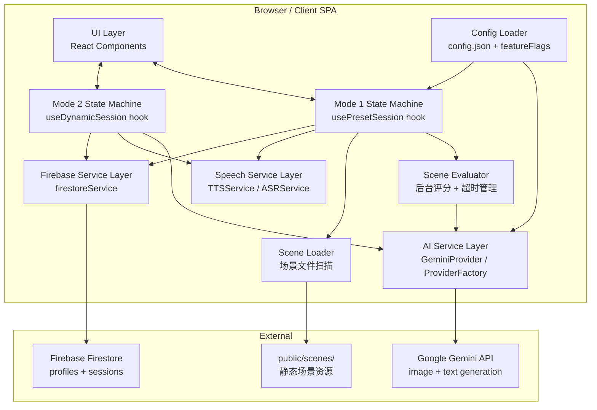
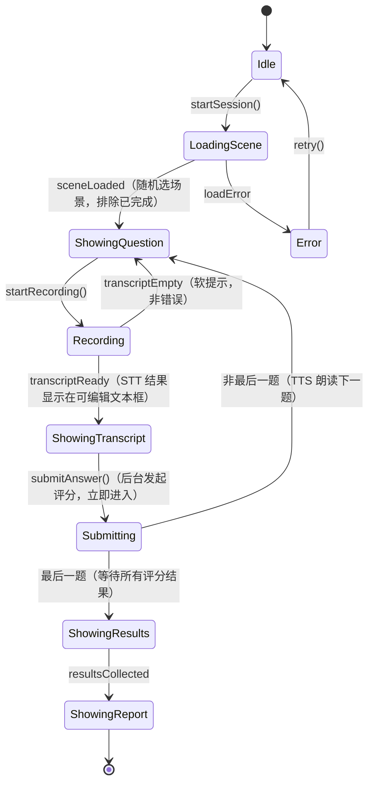
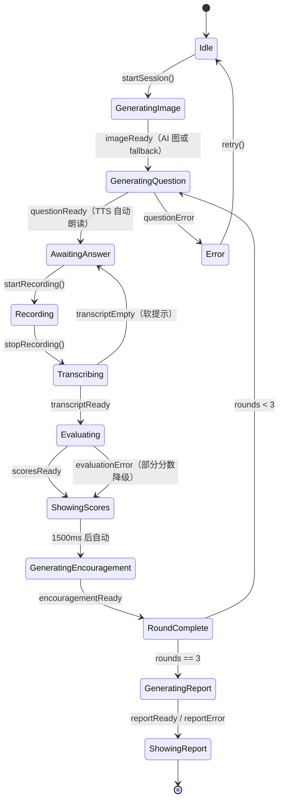
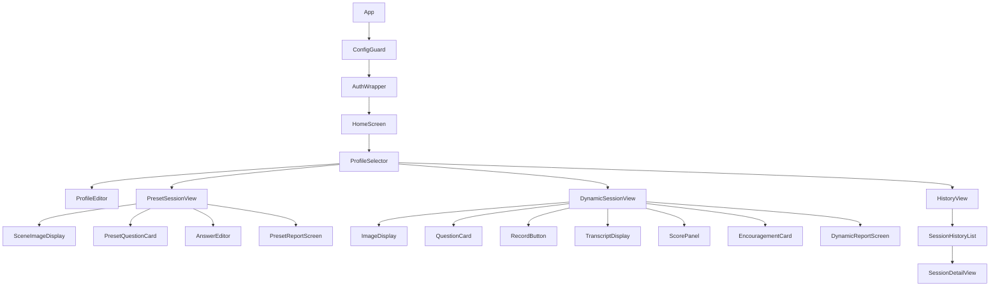

# Design Document：Chat With Me

## Overview

Chat With Me 是一个响应式 Web 应用，帮助中国大陆的儿童通过看图说话练习英语口语。应用提供两种模式：**固定场景模式（Mode 1）** 使用预先准备的静态场景资源，AI 仅在后台评分，体验流畅无卡顿；**AI 动态模式（Mode 2）** 由 Gemini 实时生成图片和问题，内容无限多样。儿童档案和历史记录通过 Firebase Firestore 持久化，支持多设备访问。

**核心设计目标：**
- 简洁无干扰的 UI，适合 10–18 岁儿童
- Mode 1 将 AI 等待时间分散在答题过程中，消除明显卡顿
- Mode 2 通过 Google Gemini 驱动完整内容生成管线（可配置切换）
- 浏览器原生语音（Web Speech API）——无需服务端音频处理
- 配置文件驱动的 AI 提供商选择——切换提供商无需改代码
- 离线容忍的 Firebase 同步，保障跨设备历史记录可靠性

**技术选型依据：**
- Google Gemini 支持 `gemini-2.0-flash-exp` 原生图片生成（multimodal output）和 `gemini-1.5-flash` 文字生成，均通过 `@google/generative-ai` JavaScript SDK 调用。
- Web Speech API（`SpeechSynthesis` TTS + `SpeechRecognition` ASR）在 Chrome 25+、Edge 87+、Safari 14.1+ 原生支持。Firefox 的 `SpeechRecognition` 需启用 flag 且不稳定，应提示用户。
- Firebase Firestore（模块化 SDK v9+）支持实时同步、离线持久化和细粒度安全规则。

---

## Architecture

应用为纯客户端 SPA（无自定义后端）。所有 AI 调用直接从客户端发出，Firebase SDK 直接操作 Firestore，安全规则在 Firebase 侧执行数据隔离。



**架构决策：**

1. **纯客户端，无自定义后端：** 简化部署（静态托管），消除服务器维护成本。API 密钥存于 config 文件，适用于家庭私人部署场景。
2. **两个模式独立状态机：** `usePresetSession` 和 `useDynamicSession` 各自管理生命周期，代码隔离，可独立实现和测试，互不影响。
3. **后台并发评分（Mode 1）：** `SceneEvaluator` 在每题提交后立即 fire-and-forget 发起评分请求，将 AI 等待时间分散至答题过程，结算页仅需短暂等待。15 秒超时保障不因单题失败阻塞整体。
4. **场景文件系统管理：** Mode 1 的场景内容通过文件夹直接管理，`public/scenes/index.json` 作为目录索引，内容准备者无需接触代码。
5. **Provider 抽象：** 所有 AI 调用通过 `AIProviderInterface` 路由，更换提供商只需新建适配类并修改 config。
6. **Feature Flags：** 两个模式的可用性由 `featureFlags.ts` 常量控制，支持独立开发和渐进发布。

---

## Mode 1：固定场景模式详细设计

### 场景资源结构

```
public/scenes/
├── index.json                   ← 所有场景 ID 列表
├── primary_zoo/
│   ├── meta.json                ← 场景元数据（id, title, gradeLevel, imageDescription）
│   ├── image.jpg                ← 场景图片
│   └── questions.json           ← 问题列表（3–5 题，含 order 字段）
└── junior_city_life/
    └── ...
```

文件夹命名格式：`{gradeLevel}_{名称}`，App 从前缀自动识别年级。

### Mode 1 会话流程



**关键设计点：**
- `submitAnswer()` 是非阻塞的：提交后立即显示下一题，评分在后台进行
- ASR 错误在 Mode 1 中不中断会话，只显示软提示（孩子可手动输入）
- 评分时将图片 base64 发给 AI（主路径），失败时降级为文字描述（备用路径）
- `ShowingResults` 状态下等待所有 `Promise` settle（含超时保障）

### 场景选择算法

```
1. 加载 index.json，获取所有场景 ID
2. 查询 Firestore 获取该 Profile 完成过的场景 ID（completedIds）
3. 用 Profile 的 gradeLevel 过滤场景（可选）
4. 从未完成的场景中随机选取
5. 若所有场景均已完成，重置 completedIds，从全部场景中重新随机
```

---

## Mode 2：AI 动态模式详细设计

### Mode 2 会话流程



**与 Mode 1 的关键差异：**
- 每个 AI 步骤（生图、出题、评分、鼓励、报告）均为同步等待，用户在每步可能需要等待
- ASR 为只读展示（不可编辑），评分在答题后立即展示，不等到最后汇总
- 鼓励语在每轮结束后立即展示，而非结算时汇总

---

## Components and Interfaces

### Component Hierarchy



### Key Data Interfaces

```typescript
// 共享数据类型
interface Profile {
  id: string;
  name: string;
  gradeLevel: GradeLevel;
  createdAt: Timestamp;
  updatedAt: Timestamp;
}

type GradeLevel = 'primary' | 'junior' | 'senior';

interface Session {
  id: string;
  profileId: string;
  sessionMode: 'preset' | 'dynamic';  // 区分模式
  sceneId?: string;                    // Mode 1 专用
  createdAt: Timestamp;
  imageDescription: string;
  imageUrl: string;
  rounds: Round[];
  report: Report | null;
  compositeScore: number | null;
  status: 'in_progress' | 'complete' | 'error';
}

interface Round {
  roundNumber: number;
  question: string;
  transcript: string;
  scores: EvaluationScores;
  encouragement: string;
}

interface EvaluationScores {
  vocabulary: number | null;
  pronunciation: number | null;
  grammar: number | null;
  relevance: number | null;
}

// Mode 1 专用
interface SceneMeta {
  id: string;
  title: string;
  gradeLevel: GradeLevel;
  imageAlt: string;
  imageDescription: string;
  imagePath: string;
  questionsPath: string;
}

interface SceneQuestion {
  id: string;
  text: string;
  order: number;
}
```

### AI Provider Interface

```typescript
interface AIProviderInterface {
  // Mode 2 专用
  generateImage(prompt: string, gradeLevel: GradeLevel): Promise<GeneratedImage>;
  generateQuestion(params: QuestionParams): Promise<string>;

  // 两个模式共用
  evaluateAnswer(params: EvaluationParams): Promise<EvaluationScores>;
  evaluateAnswerWithImage(params: EvaluationWithImageParams): Promise<EvaluationScores>;
  generateEncouragement(params: EncouragementParams): Promise<string>;
  generateReport(params: ReportParams): Promise<Report>;
}
```

---

## Data Models

### Firestore Collection Structure

```
users/{userId}/
  profiles/{profileId}
  sessions/{sessionId}
```

**Session document（新增字段）：**
```json
{
  "id": "s_xyz789",
  "profileId": "p_abc123",
  "sessionMode": "preset",
  "sceneId": "primary_zoo",
  "status": "complete",
  "createdAt": "<Timestamp>",
  "imageDescription": "A colorful zoo with elephants and giraffes",
  "imageUrl": "/scenes/primary_zoo/image.jpg",
  "rounds": [...],
  "report": {...},
  "compositeScore": 83
}
```

### Config File Schema（`public/config.json`）

```json
{
  "aiProvider": "gemini",
  "gemini": {
    "apiKey": "YOUR_GEMINI_API_KEY",
    "imageModel": "gemini-2.0-flash-exp",
    "textModel": "gemini-1.5-flash"
  },
  "tts": {
    "lang": "en-US",
    "voice": "Google US English",
    "rate": 0.9,
    "pitch": 1.0
  },
  "asr": {
    "lang": "en-US"
  },
  "firebase": {
    "apiKey": "YOUR_FIREBASE_API_KEY",
    "authDomain": "your-project.firebaseapp.com",
    "projectId": "your-project-id",
    "storageBucket": "your-project.appspot.com",
    "messagingSenderId": "123456789",
    "appId": "1:123456789:web:abcdef"
  },
  "mode1": {
    "evaluationTimeoutMs": 15000
  }
}
```

---

## Error Handling

| 错误情况 | 处理策略 |
|---|---|
| Mode 1 场景加载失败 | 显示错误 + 重试按钮 |
| Mode 1 单题评分超时（15s） | 该题显示"评分不可用"，不阻塞其他题 |
| Mode 1 图片发送失败（评分时） | 降级为纯文字描述评分 |
| Mode 2 AI 生图失败 | 使用 fallback 静态图片，继续会话 |
| Mode 2 问题生成失败 | 显示错误 + 重试，不推进轮次 |
| ASR 技术故障 | 显示错误信息 + 允许重试 |
| ASR 无声/空转录 | 显示软提示"没有听清"，**不显示错误** |
| TTS 不可用 | 显示通知，问题文字保持可见 |
| Firebase 写入失败 | SDK 离线队列自动重试 |
| 历史加载中 | 全屏 loading，**不展示部分数据** |
| Config 缺失/无效 | 阻止启动，显示字段级错误 |
| 非安全上下文（HTTP） | 显示明确 HTTPS 要求提示 |

---

## Testing Strategy

### Unit Tests（Vitest）

- Config loader：有效配置、缺失字段、无效值
- Profile validator：有效名称、空名称、纯空白名称
- Score calculator：边界值（全 0、全 100、含 null）
- Prompt builders：各年级提示词内容、轮次上下文包含
- Scene loader：场景索引解析、年级前缀识别、pickRandomScene 去重逻辑
- Scene evaluator：超时行为、Promise.race 结果、reset 清理
- usePresetSession 状态机：所有状态转换，提交后立即切题
- useDynamicSession 状态机：所有状态转换，包含 fallback 图片路径
- History sorter：时间戳排序、相同时间戳的稳定排序

### Property-Based Tests（fast-check，每项至少 100 次）

1. **Profile 名称空白拒绝**：任意纯空白字符串均被拒绝
2. **Profile 序列化往返**：任意合法 Profile 序列化后反序列化等于原值
3. **综合分数范围**：任意三轮四维分数（含 null）计算结果始终在 [0, 100]
4. **年级问题提示词特异性**：任意年级的提示词包含该年级特有指令，不含其他年级指令
5. **轮次上下文包含**：Round 2/3 的提示词包含所有前序问题
6. **Config 校验分类**：任意缺失必填字段的 config 均返回失败；任意完整 config 返回成功
7. **场景随机选择不重复**：completedIds 不为全集时，pickedScene 不在 completedIds 中
8. **场景全部完成后重置**：completedIds 包含所有场景时，pickRandomScene 仍返回有效场景
9. **Session 历史降序排序**：任意插入顺序的 Session 列表，排序后始终按时间降序

### Integration Tests（Firebase Emulator + Mock Gemini）

- Profile CRUD 正确持久化
- Session 数据（含 sceneId）完整保存
- `getCompletedSceneIds` 正确返回已完成场景
- Config 加载读取正确值

### Accessibility Tests

- `axe-core` 自动扫描所有主要页面
- 主色调对比度人工验证
- 键盘导航人工测试

### Browser Compatibility

| 浏览器 | TTS | ASR | 预期 |
|---|---|---|---|
| Chrome 120+ | ✅ | ✅ | 完整支持 |
| Edge 120+ | ✅ | ✅ | 完整支持 |
| Safari 16+ | ✅ | ✅ | 完整支持 |
| Firefox 120+ | ✅ | ⚠️ | TTS 可用；ASR 需 flag，显示警告 |
