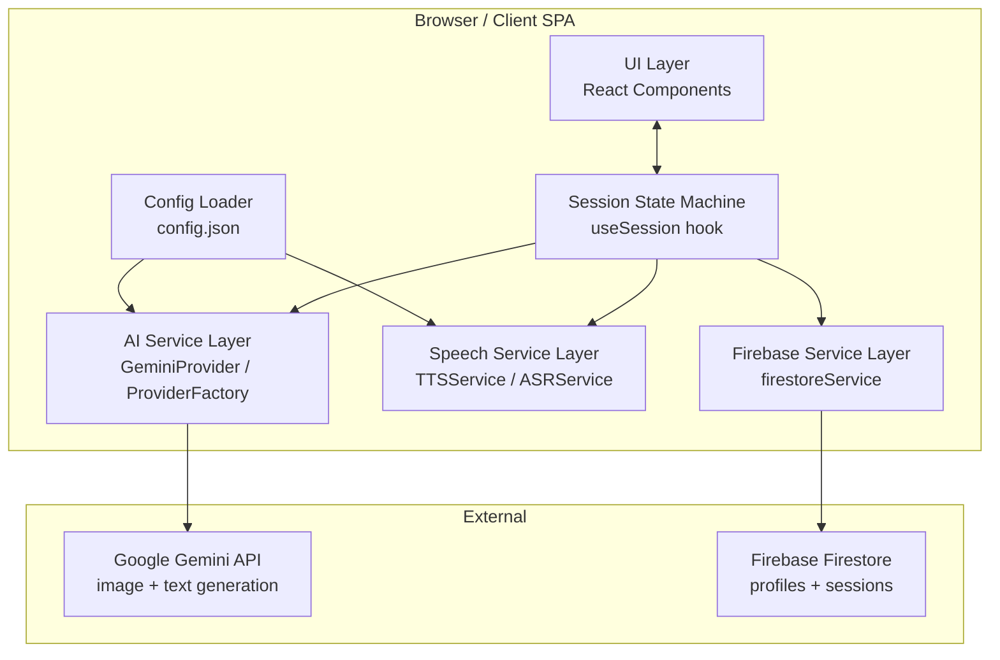
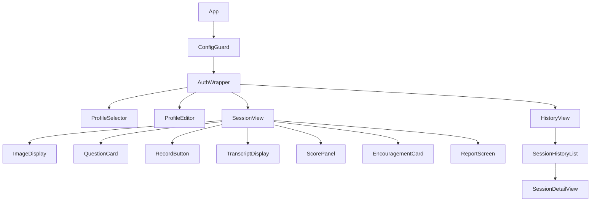
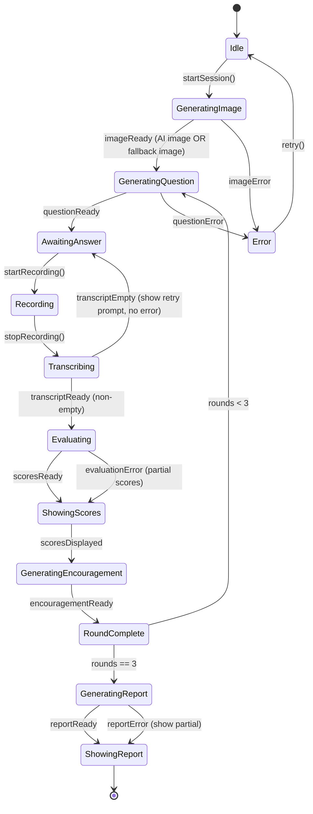

# Design Document: English Learning App

## Overview

The English Learning App is a responsive web application designed to help children in mainland China practice spoken English through an interactive picture-description activity. Each learning session follows a structured flow: the app generates an AI-created image, asks three progressive questions about it, records and evaluates the child's spoken English answers, delivers encouragement, and concludes with a session report. Child profiles and session history are persisted in Firebase Firestore, enabling multi-device access.

**Key design goals:**
- Simple, distraction-free UI for children aged 10–18
- AI-driven content pipeline via Google Gemini (configurable to other providers)
- Browser-native speech (Web Speech API) — no server-side audio processing
- Config-file-driven AI provider selection — no code changes to switch providers
- Offline-tolerant Firebase sync for reliable cross-device history

**Research findings:**
- Google Gemini supports native image generation via `gemini-2.0-flash-exp` (multimodal output) and dedicated Imagen models via the `@google/generative-ai` JavaScript SDK. Text generation uses `gemini-1.5-flash` or `gemini-2.0-flash`. [Source: ai.google.dev](https://ai.google.dev/gemini-api/docs/image-generation)
- Web Speech API (`SpeechSynthesis` for TTS, `SpeechRecognition` for ASR) is supported natively in Chrome 25+, Edge 87+, Safari 14.1+, and Samsung Internet. Firefox support for `SpeechRecognition` requires a flag and is not fully reliable. The app must note this limitation to users. [Source: MDN](https://developer.mozilla.org/en-US/docs/Web/API/SpeechRecognition)
- Firebase Firestore (modular SDK v9+) supports real-time sync, offline persistence, and fine-grained security rules — appropriate for multi-device child profile management. [Source: Firebase docs](https://firebase.google.com/docs/firestore)

---

## Architecture

The application is a client-side Single Page Application (SPA). There is no custom backend server. All AI calls are made from the client to the Gemini API (or configured provider). Firebase Firestore is used directly from the client via the Firebase JS SDK, with security rules enforcing data isolation per user.



**Architectural decisions:**
1. **Client-only (no custom backend):** Simplifies deployment (static hosting on Firebase Hosting or similar) and removes server maintenance cost. API keys are stored in a config file loaded at startup, which is acceptable for a personal/family application. For a production multi-tenant app, keys should move server-side.
2. **Provider abstraction:** All AI calls go through a `AIProviderInterface` so swapping Gemini for another provider only requires a new adapter class and a config change.
3. **Session state machine:** A finite state machine governs the session lifecycle, making state transitions explicit and testable.
4. **Web Speech API (browser-native):** Avoids audio upload costs and latency. The known limitation is Firefox's incomplete `SpeechRecognition` support — the app will warn users on unsupported browsers.

---

## Components and Interfaces

### Component Hierarchy



### Key Component Interfaces

```typescript
// Profile management
interface Profile {
  id: string;
  name: string;
  gradeLevel: GradeLevel;
  createdAt: Timestamp;
  updatedAt: Timestamp;
}

type GradeLevel = 'primary' | 'junior' | 'senior';

// Session data model (stored in Firestore)
interface Session {
  id: string;
  profileId: string;
  createdAt: Timestamp;
  imageDescription: string;
  imageUrl: string;           // base64 or storage URL
  rounds: Round[];            // exactly 3 when complete
  report: Report | null;
  compositeScore: number | null;
  status: 'in_progress' | 'complete' | 'error';
}

interface Round {
  roundNumber: 1 | 2 | 3;
  question: string;
  transcript: string;
  scores: EvaluationScores;
  encouragement: string;
}

interface EvaluationScores {
  vocabulary: number;       // 0-100
  pronunciation: number;    // 0-100
  grammar: number;          // 0-100
  relevance: number;        // 0-100
}

interface Report {
  compositeScore: number;   // 0-100
  analysis: string;         // <= 150 words
  generatedAt: Timestamp;
}
```

### AI Provider Interface

```typescript
interface AIProviderInterface {
  generateImage(prompt: string, gradeLevel: GradeLevel): Promise<GeneratedImage>;
  generateQuestion(params: QuestionParams): Promise<string>;
  evaluateAnswer(params: EvaluationParams): Promise<EvaluationScores>;
  generateEncouragement(params: EncouragementParams): Promise<string>;
  generateReport(params: ReportParams): Promise<Report>;
}

interface GeneratedImage {
  base64Data: string;
  mimeType: string;
  description: string;  // AI-generated description used for evaluation context
}

interface QuestionParams {
  gradeLevel: GradeLevel;
  /**
   * AI-generated description of the currently displayed image, OR the
   * description of a fallback image when AI image generation failed.
   * Question generation proceeds regardless of which source provided the
   * image (Req 2.3).
   */
  imageDescription: string;
  previousQuestions: string[];
  roundNumber: 1 | 2 | 3;
}

interface EvaluationParams {
  question: string;
  transcript: string;
  imageDescription: string;
  gradeLevel: GradeLevel;
}

interface EncouragementParams {
  childName: string;
  scores: EvaluationScores;
  roundNumber: number;
}

interface ReportParams {
  childName: string;
  gradeLevel: GradeLevel;
  rounds: Round[];
}
```

### Speech Service Interfaces

```typescript
interface TTSService {
  speak(text: string, lang: string): Promise<void>;
  /**
   * Interrupt any ongoing playback and immediately begin speaking `text`.
   * The visual indication cycle restarts from the default state.
   * Equivalent to stop() followed by speak(), but exposed as a single atomic
   * operation so the UI can distinguish an intentional interrupt (Req 4.6)
   * from a plain stop (Req 4.4).
   */
  interruptAndSpeak(text: string, lang: string): Promise<void>;
  stop(): void;
  isSpeaking(): boolean;
  isAvailable(): boolean;
  /**
   * Fires only when TTS transitions from the default (idle) state to speaking.
   * Does NOT fire when `interruptAndSpeak` is called while already speaking;
   * in that case the caller is responsible for restarting the visual cycle
   * directly (Req 4.3, 4.6).
   */
  onStart(cb: () => void): void;
  onEnd(cb: () => void): void;
  onError(cb: (err: Error) => void): void;
}

interface ASRService {
  startRecording(lang: string): void;
  stopRecording(): void;
  isAvailable(): boolean;
  /**
   * Fires with a non-empty transcript on successful recognition.
   * An empty string result is NOT surfaced here; instead the caller receives
   * an `onEmptyResult` callback and shows a retry prompt — not an error
   * message (Req 5.7).
   */
  onResult(cb: (transcript: string) => void): void;
  /**
   * Fires when recording ends with an empty transcript and no technical
   * failure (e.g., the child was silent). The UI SHALL show a retry prompt
   * only — no error message (Req 5.7).
   */
  onEmptyResult(cb: () => void): void;
  /**
   * Fires on a technical failure (microphone unavailable, API error, etc.).
   * The UI SHALL display an error message and allow retry (Req 5.6).
   */
  onError(cb: (err: Error) => void): void;
}
```

---

## Data Models

### Firestore Collection Structure

```
users/{userId}/
  profiles/{profileId}          ← Profile document
  sessions/{sessionId}          ← Session document (contains embedded rounds)
```

**Profile document:**
```json
{
  "id": "p_abc123",
  "name": "小明",
  "gradeLevel": "primary",
  "createdAt": "<Timestamp>",
  "updatedAt": "<Timestamp>"
}
```

**Session document:**
```json
{
  "id": "s_xyz789",
  "profileId": "p_abc123",
  "createdAt": "<Timestamp>",
  "status": "complete",
  "imageDescription": "A colorful zoo with elephants and giraffes",
  "imageUrl": "data:image/png;base64,...",
  "rounds": [
    {
      "roundNumber": 1,
      "question": "What animals can you see in the picture?",
      "transcript": "I can see an elephant and a giraffe",
      "scores": { "vocabulary": 82, "pronunciation": 75, "grammar": 88, "relevance": 90 },
      "encouragement": "Great job, 小明! You named the animals clearly!"
    }
  ],
  "report": {
    "compositeScore": 83,
    "analysis": "小明 demonstrated strong vocabulary and relevance...",
    "generatedAt": "<Timestamp>"
  },
  "compositeScore": 83
}
```

### Config File Schema (`config.json`)

```json
{
  "aiProvider": "gemini",
  "gemini": {
    "apiKey": "YOUR_GEMINI_API_KEY",
    "imageModel": "gemini-2.0-flash-exp",
    "textModel": "gemini-1.5-flash"
  },
  "tts": {
    "lang": "en-US",
    "voice": "Google US English",
    "rate": 0.9,
    "pitch": 1.0
  },
  "asr": {
    "lang": "en-US"
  },
  "firebase": {
    "apiKey": "YOUR_FIREBASE_API_KEY",
    "authDomain": "your-project.firebaseapp.com",
    "projectId": "your-project-id",
    "storageBucket": "your-project.appspot.com",
    "messagingSenderId": "123456789",
    "appId": "1:123456789:web:abcdef"
  }
}
```

**Required fields validation:** `aiProvider`, `[provider].apiKey`, `[provider].imageModel`, `[provider].textModel`, `tts.lang`, `firebase.projectId` and `firebase.apiKey` must all be present and non-empty.

---

## Session State Machine

The session lifecycle is modeled as an explicit finite state machine:



**State notes:**

- `GeneratingImage → GeneratingQuestion`: This transition fires whether the displayed image was produced by the AI or is a fallback image. Question generation always uses the description of whichever image is currently on screen (Req 2.3).
- `Transcribing → AwaitingAnswer` (transcriptEmpty): When ASR returns an empty transcript after recording ends *without a technical failure*, the machine returns to `AwaitingAnswer` and the UI shows a retry prompt only — **no error message** (Req 5.7). A technical failure (mic unavailable, API error) transitions to a dedicated `ASRError` sub-state and shows an error message (Req 5.6).
- `Error` state: On entry, the UI **always** shows the user-friendly error message **and** the retry action — the error banner is never suppressed (Req 2.5).
- TTS interrupt (Req 4.6): When the child taps the speaker icon while `isSpeaking()` is true, `TTSService.interruptAndSpeak()` is called. The session state machine does not change state; the UI layer resets its own visual-indicator cycle (animated icon) immediately on the interrupt call, then lets the new `onEnd` callback restore the default icon. The `onStart` callback is **not** used to trigger the visual indicator when interrupting — it fires only on a fresh start from the idle state (Req 4.3).

---

## Key Algorithm Flows

### Image Generation Prompt Construction

The image generation prompt is tailored by grade level:

```
Grade primary:  "Generate a simple, colorful illustration suitable for children aged 10-12.
                 The scene should show [category] with clear, recognizable elements.
                 Avoid complex backgrounds. Style: flat illustration, bright colors."

Grade junior:   "Generate an engaging scene suitable for teenagers aged 13-15.
                 The image should depict [category] with enough detail to prompt
                 descriptive discussion. Style: realistic illustration."

Grade senior:   "Generate a thought-provoking scene suitable for students aged 16-18.
                 The image should depict [category] with rich contextual detail
                 that invites reflection. Style: photorealistic."
```

Image categories are drawn from a curated list: animals, nature, city life, school, sports, food, family, travel.

### Question Generation Prompt Construction

Question generation is triggered whenever an image is displayed on screen — whether the image was produced by the AI or is a fallback image. The `imageDescription` passed to `buildQuestionPrompt` is always the description of the currently displayed image, regardless of its source (Req 2.3).

```typescript
function buildQuestionPrompt(params: QuestionParams): string {
  const gradeInstructions = {
    primary: `Ask a simple factual question with a clear answer (e.g., "What color is the dog?", 
              "Where is the animal?"). Use vocabulary appropriate for ages 10-12.`,
    junior:  `Ask an open-ended descriptive question (e.g., "Could you tell me what is happening here?",
              "What can you see in different parts of this picture?"). Suitable for ages 13-15.`,
    senior:  `Ask a reflective or analytical question requiring personal thought 
              (e.g., "How does this scene make you feel?", "What do you think will happen next?").
              Suitable for ages 16-18.`
  };

  const continuityClause = params.previousQuestions.length > 0
    ? `The previous questions were: ${params.previousQuestions.map((q, i) => `Round ${i+1}: "${q}"`).join('; ')}. 
       Generate a new question that explores a different aspect of the same image.`
    : '';

  return `
    You are helping a Chinese student practice English.
    Image description: "${params.imageDescription}"
    Round: ${params.roundNumber} of 3.
    ${continuityClause}
    ${gradeInstructions[params.gradeLevel]}
    Respond with ONLY the question text, no additional explanation.
  `;
}
```

### Evaluation Prompt Construction

```typescript
function buildEvaluationPrompt(params: EvaluationParams): string {
  const strictnessNote = params.gradeLevel !== 'primary'
    ? 'Apply stricter grammar and relevance criteria appropriate for intermediate/advanced learners.'
    : 'Apply lenient criteria appropriate for beginners.';

  return `
    You are an English language evaluator for Chinese students.
    Image context: "${params.imageDescription}"
    Question asked: "${params.question}"
    Student's answer (transcribed from speech): "${params.transcript}"
    Grade level: ${params.gradeLevel}
    ${strictnessNote}

    Score the answer on four dimensions (0-100 each):
    1. Vocabulary Accuracy: Are the words used appropriate and correctly applied?
    2. Pronunciation Accuracy: Infer from the transcription quality and word choices.
    3. Grammar Correctness: Is the sentence structure grammatically correct?
    4. Answer Relevance: Does the answer address the question and image content?

    Respond ONLY with valid JSON in this exact format:
    {
      "vocabulary": <number>,
      "pronunciation": <number>,
      "grammar": <number>,
      "relevance": <number>
    }
  `;
}
```

### Composite Score Calculation

```typescript
function calculateCompositeScore(rounds: Round[]): number {
  const dimensionWeights = {
    vocabulary: 0.25,
    pronunciation: 0.25,
    grammar: 0.25,
    relevance: 0.25
  };

  const allScores = rounds.flatMap(r => [r.scores]);
  const totals = allScores.reduce((acc, s) => ({
    vocabulary: acc.vocabulary + s.vocabulary,
    pronunciation: acc.pronunciation + s.pronunciation,
    grammar: acc.grammar + s.grammar,
    relevance: acc.relevance + s.relevance
  }), { vocabulary: 0, pronunciation: 0, grammar: 0, relevance: 0 });

  const n = rounds.length;
  const composite =
    (totals.vocabulary / n) * dimensionWeights.vocabulary +
    (totals.pronunciation / n) * dimensionWeights.pronunciation +
    (totals.grammar / n) * dimensionWeights.grammar +
    (totals.relevance / n) * dimensionWeights.relevance;

  return Math.round(Math.max(0, Math.min(100, composite)));
}
```

---

## Correctness Properties

*A property is a characteristic or behavior that should hold true across all valid executions of a system — essentially, a formal statement about what the system should do. Properties serve as the bridge between human-readable specifications and machine-verifiable correctness guarantees.*

This feature's pure logic (profile validation, score calculation, prompt building, config validation, session state transitions) is well-suited for property-based testing. Infrastructure concerns (Firebase sync, AI API calls) are covered by integration tests.

The property-based testing library used is **fast-check** (TypeScript/JavaScript).

### Property 1: Profile name whitespace rejection

*For any* string composed entirely of whitespace characters (spaces, tabs, newlines, or any combination), the profile name validator SHALL reject it and return a validation error.

**Validates: Requirements 1.6**

### Property 2: Profile round-trip serialization

*For any* valid profile (non-empty name, valid grade level), serializing it to a Firestore document and deserializing it back SHALL produce an object equal to the original profile.

**Validates: Requirements 1.1, 1.2**

### Property 3: Profile deletion removes all sessions

*For any* profile with N associated sessions (N ≥ 0), after deleting the profile, neither the profile nor any of its N sessions SHALL be present in the data store.

**Validates: Requirements 1.3**

### Property 4: Grade-level-specific question prompts

*For any* grade level (primary, junior, senior), the question prompt builder SHALL produce a prompt string that contains the grade-level-specific instruction vocabulary and does NOT contain instruction vocabulary belonging to other grade levels.

**Validates: Requirements 3.2, 3.3, 3.4**

### Property 5: Round 2 and 3 prompts include prior context

*For any* session where at least one round has been completed, the prompt for the next round SHALL contain the text of all previous questions from that session.

**Validates: Requirements 3.6**

### Property 6: Composite score stays within valid range

*For any* combination of three rounds each with four dimension scores in [0, 100], the composite score calculation SHALL produce a result in [0, 100].

**Validates: Requirements 8.2**

### Property 7: Config validation correctly classifies configs

*For any* configuration object missing at least one required field, the config validator SHALL return a validation failure. *For any* configuration object where all required fields are present and non-empty, the config validator SHALL return a validation success.

**Validates: Requirements 10.2, 10.4**

### Property 8: Provider factory returns correct adapter

*For any* supported provider name (e.g., "gemini") in the config, the AI provider factory SHALL return an adapter object that implements the `AIProviderInterface`.

**Validates: Requirements 10.5**

### Property 9: Session does not terminate before three rounds

*For any* session state with fewer than three completed rounds, the session state machine SHALL NOT be in a terminal state (ShowingReport or complete).

**Validates: Requirements 7.4**

### Property 10: Session history is chronologically ordered

*For any* list of sessions belonging to a profile, the history display function SHALL return them sorted in reverse-chronological order (most recent first) regardless of the insertion order.

**Validates: Requirements 9.2**

---

## Error Handling

| Error Condition | Recovery Strategy |
|---|---|
| AI image generation fails | **Always** show user-friendly error banner + "Try Again" button, even when the retry option is present (Req 2.5); remain on session start screen |
| AI image generation fails (fallback path) | Display a fallback static image; proceed immediately to question generation using the fallback image's description (Req 2.3) |
| AI question generation fails | **Always** show user-friendly error banner + "Try Again" button (Req 2.5); do not advance round |
| ASR unavailable (browser) | Show browser compatibility warning at session start; suggest Chrome/Edge |
| ASR returns empty transcript (no technical failure) | Show inline retry prompt only ("We didn't catch that — please try again"); **do NOT show an error message** (Req 5.7) |
| ASR error during recording (technical failure) | Show error message + allow retry (Req 5.6) |
| TTS unavailable | Show notification; question text remains visible on screen |
| TTS already speaking when speaker tapped | Call `interruptAndSpeak()`: stop current playback, start new playback, reset visual indicator immediately; `onStart` is NOT used for this path (Req 4.3, 4.6) |
| Evaluator API failure | Show available scores (if any); indicate missing dimensions; allow continuing |
| Evaluator returns malformed JSON | Parse what is available; default to null for missing dimensions |
| Report generation failure | Show individual round scores; show "Report unavailable" message; save partial data |
| Firebase write failure | Queue write for retry (Firebase SDK offline persistence handles this automatically) |
| Firebase history load in progress | Show loading indicator for the entire Profile's history; **do NOT display any partial data** until all session data for the selected Profile has fully loaded (Req 9.5) |
| Config file missing or invalid | Block app startup; show configuration error screen with field-level detail |
| API key invalid / quota exceeded | Show provider error with actionable message (check API key, check quota) |

**Error state principles:**
- Errors within a session should never lose already-collected data
- Every recoverable error exposes a retry action
- Error messages are **always** displayed when an AI generation failure occurs, regardless of whether a retry option is also available (Req 2.5)
- Empty ASR transcripts are **not** errors — they use a soft retry prompt, not an error message (Req 5.7)
- History screens show a loading indicator and hold back all data until the full Profile load completes — no partial renders (Req 9.5)
- Network/Firebase errors leverage the SDK's built-in offline persistence queue
- All errors are logged to the browser console with full context for debugging

---

## Testing Strategy

### Overview

The testing strategy uses a dual approach:
- **Unit tests** for specific examples, edge cases, and error conditions using **Vitest**
- **Property-based tests** for universal properties using **fast-check** (minimum 100 iterations each)
- **Integration tests** for Firebase and AI API wiring (limited examples, run separately)

### Unit Tests

Focus areas:
- Config loader: valid config, missing fields, invalid values
- Profile validator: valid names, empty names, whitespace-only names
- Score calculator: boundary values (all 0, all 100, mixed)
- Prompt builder: grade-level prompt output, round context inclusion; verify fallback-image descriptions are accepted as valid `imageDescription` inputs (Req 2.3)
- Session state machine: all valid state transitions, invalid transition guards; verify `transcriptEmpty` → `AwaitingAnswer` does NOT set error state (Req 5.7); verify `imageReady` from fallback → `GeneratingQuestion` (Req 2.3)
- AI response parser: valid JSON scores, malformed JSON, partial scores
- History sorter: ordering of sessions by timestamp
- TTS service: `interruptAndSpeak` calls `stop()` then `speak()` atomically; `onStart` fires only when transitioning from idle (Req 4.3, 4.6)
- History loader: verifies that partial data is held until the full Profile load resolves (Req 9.5)

### Property-Based Tests (fast-check)

Each test runs a minimum of 100 iterations. Tests are tagged with their corresponding design property.

```typescript
// Tag format: Feature: english-learning-app, Property N: <description>

// Property 1: Profile name whitespace rejection
// Feature: english-learning-app, Property 1: Profile name whitespace rejection
test('whitespace-only names are always rejected', () => {
  fc.assert(fc.property(
    fc.stringOf(fc.constantFrom(' ', '\t', '\n', '\r')).filter(s => s.length > 0),
    (whitespaceStr) => {
      const result = validateProfileName(whitespaceStr);
      return result.valid === false;
    }
  ), { numRuns: 100 });
});

// Property 6: Composite score range
// Feature: english-learning-app, Property 6: Composite score stays within valid range
test('composite score is always in [0, 100]', () => {
  fc.assert(fc.property(
    fc.array(fc.record({
      vocabulary: fc.integer({ min: 0, max: 100 }),
      pronunciation: fc.integer({ min: 0, max: 100 }),
      grammar: fc.integer({ min: 0, max: 100 }),
      relevance: fc.integer({ min: 0, max: 100 })
    }), { minLength: 3, maxLength: 3 }),
    (scoreSets) => {
      const rounds = scoreSets.map((scores, i) => ({ roundNumber: i + 1, scores } as Round));
      const composite = calculateCompositeScore(rounds);
      return composite >= 0 && composite <= 100;
    }
  ), { numRuns: 100 });
});
```

### Integration Tests

Run against a Firebase emulator and a mocked Gemini API:
- Profile CRUD operations persist correctly to Firestore
- Session data is saved with all required fields after completion
- Session history loads from Firestore in correct order
- Config loading reads values correctly from `config.json`

### Accessibility Tests

- `axe-core` automated scan on all main screens (profile selector, session view, history view, report screen)
- Manual contrast ratio verification for primary color palette
- Manual keyboard navigation test

### Responsive Layout Tests

- Verify single uncluttered layout at standard breakpoints (375px–1440px) with no scrolling required during an active Round
- Verify that on very small screens (below ~360px viewport height or equivalent constrained dimensions) scrolling is permitted and all UI elements remain at minimum readable sizes — buttons, question text, and score display must not be clipped or scaled below the 16px minimum (Req 11.5)

### Browser Compatibility

Manual smoke test matrix:
| Browser | TTS | ASR | Expected |
|---------|-----|-----|----------|
| Chrome 120+ | ✅ | ✅ | Full support |
| Edge 120+ | ✅ | ✅ | Full support |
| Safari 16+ | ✅ | ✅ | Full support |
| Firefox 120+ | ✅ | ⚠️ | TTS works; ASR requires flag — show warning |
